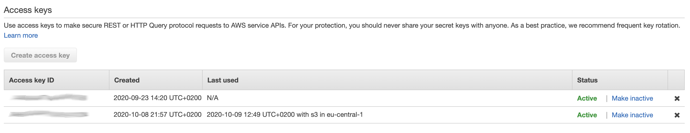

# Laravel ^7.2 Backup Module

[](//packagist.org/packages/duncanrmorris/backupmodule)
[](//packagist.org/packages/duncanrmorris/backupmodule)
[](//packagist.org/packages/duncanrmorris/backupmodule)
[](//packagist.org/packages/duncanrmorris/backupmodule)

This Laravel package allows users to quickly and simply backup your Laravel app database and "./storage" directory into Amazon s3 Storage.  

This package is designed to be used along side other packages and services provided by DRMorris IT Services.  For more information, check out www.drmorris-itservices.de

## Installation

### Step 1

Setup your Laravel ^7.2 application as required.  Then run the command:

```
Composer require duncanrmorris/backupmodle
```
This will then download and install the module.

### Step 2
Update your ./config/app.php file to include the new providers:

````
 'providers' => [

        /*
         * Laravel Framework Service Providers...
         */
        Illuminate\Auth\AuthServiceProvider::class,
        Illuminate\Broadcasting\BroadcastServiceProvider::class,
        Illuminate\Bus\BusServiceProvider::class,
        ///
        duncanrmorris\backupmodule\BackupServiceProvider::class,
        
````

### Step 3
Once the composer has completed the download and installation, you need to run:

````
php artisan migrate
````

This will now create the required database tables.

### Step 4
Setup the navigation to acccess the new module.  Within the ./resources/views/layout/app.balde.php add the link for left navigatio:

````
<li class="nav-item"><a href="/backup" class="nav-link">Backup Module</a></li>
````

Or use the href "/backup" in your app design as required.

### Step 5
Insert your AWS s3 storage details in the ".env" file:

````
AWS_ACCESS_KEY_ID=
AWS_SECRET_ACCESS_KEY=
AWS_DEFAULT_REGION=eu-central-1
AWS_BUCKET=
````

You will be able to obtain these information from your Amazon account.  From within the IAM module -> Users -> Username -> Security Key:




